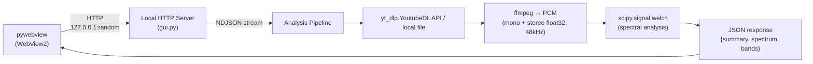

# analyze-spectrum

YouTube 動画またはローカル音声ファイルの周波数スペクトルを包括的に分析するツール。
レベル測定、スペクトル形状評価、帯域バランス解析、A/B 比較を統合的に提供する。
analyze-loudness と同一アーキテクチャ (pywebview + ローカル HTTP サーバー) で構成。

## Architecture overview



## Core analysis

解析パイプライン:

1. **PCM 抽出**: mono (`pan=mono|c0=0.5*c0+0.5*c1`, レベル保持) + stereo (True Peak 用)
2. **Welch PSD**: `scipy.signal.welch(data, fs=48000, nperseg=4096, noverlap=2048)`
3. **1/3 オクターブバンド分析**: 25Hz-10kHz (27 bands), 低周波バンド (25-40Hz) は PSD 補間で推定
4. **帯域エネルギー**: Sub (20-80Hz), Low (80-200Hz), Low-Mid (200-500Hz), Mid (500-2kHz), Presence (2-5kHz), Air (5-10kHz)
5. **Level metrics**: RMS (dBFS), True Peak (dBTP, ITU-R BS.1770 4x oversampling), Crest Factor
6. **Low/Intelligibility 比**: `10*log10(E[20-200Hz] / E[1-5kHz])`
7. **スペクトル重心**: `Σ(f * Pxx) / Σ(Pxx)` (80-8kHz)
8. **Spectral Tilt**: log2(freq) vs PSD dB の線形回帰 (dB/octave)
9. **Presence/Mid Ratio**: Presence(2-5kHz) / Mid(500-2kHz) エネルギー比
10. **Brightness**: Air(5-10kHz) / (Mid+Presence 500-5kHz) エネルギー比
11. **HPF -3dB 推定**: passband (300-600Hz) 平均から -3dB 交差点を探索
12. **HF Rolloff**: Mid-band 平均から -10dB 下回る周波数を検出
13. **Transfer Function**: 2 ファイル間の PSD 差分 (dB)

### 参照規格

- **ITU-R BS.1770**: True Peak — 4x oversampling, per-channel measurement
- **ANSI S3.5-1997**: SII band importance function (1-5kHz が明瞭度の約 72%)
- **IEC 60268-16:2020**: STI — Ed.5 で 125/250Hz 帯を大幅削減
- **Upward spread of masking**: 低域が高域をマスクする非対称性

### PCM 変換 (mono downmix)

ffmpeg のデフォルト `-ac 1` は `sqrt(2)/2 * L + sqrt(2)/2 * R` の係数を使用し、
相関したステレオ信号に +3 dB のゲインを付加する。本ツールでは
`pan=mono|c0=0.5*c0+0.5*c1` を使用してチャンネルあたりのレベルを保持する。
True Peak は ITU-R BS.1770 に従いステレオ PCM で各チャンネル個別に測定する。

## Project structure

```
analyze-spectrum/
├── CLAUDE.md
├── pyproject.toml
├── src/analyze_spectrum/
│   ├── __init__.py             # _subprocess_kwargs() helper
│   ├── __main__.py
│   ├── analysis.py             # spectral analysis core
│   ├── cli.py                  # argparse + CLI orchestration
│   ├── gui.py                  # pywebview + local HTTP server
│   ├── download.py             # yt_dlp.YoutubeDL API, ffprobe duration
│   └── pcm.py                  # ffmpeg → PCM conversion (mono + stereo)
├── frontend/
│   ├── index.html
│   ├── main.js                 # fetch + NDJSON progress + DOM rendering
│   ├── style.css
│   ├── charts/
│   │   ├── spectrum.js         # PSD overlay (log-freq, multi-track)
│   │   ├── octave.js           # 1/3 octave grouped bar chart
│   │   ├── transfer.js         # transfer function (Δ dB)
│   │   ├── lowend.js           # low-end detail (20-500Hz linear)
│   │   └── midhigh.js          # mid-high detail (500Hz-20kHz log)
│   └── vendor/                 # uPlot (bundled)
├── tests/
│   ├── conftest.py             # shared WAV fixture (_make_wav_bytes, wav_file, wav_file_b)
│   ├── test_analysis.py
│   ├── test_pcm.py
│   ├── test_cli.py
│   ├── test_download.py
│   ├── test_gui.py
│   ├── test_integration.py     # 28 HTTP integration tests (real HTTPServer, no pywebview)
│   ├── test_frontend.py        # Playwright headless Chromium runner
│   └── frontend/
│       ├── test_ui.html        # test harness page
│       └── test_ui.js          # browser-based UI state tests
├── docs/
│   └── architecture.md
├── build.py
├── analyze-spectrum.spec
├── installer.iss
├── THIRD_PARTY_LICENSES.txt
└── build_assets/bin/           # ffmpeg, ffprobe, deno (git 管理外)
```

## CLI usage

```
python -m venv .venv
.venv\Scripts\activate
pip install -e ".[dev]"

# Single file analysis
analyze-spectrum "https://www.youtube.com/watch?v=XXXXX"
analyze-spectrum ./recording.m4a

# A/B comparison
analyze-spectrum --compare original.m4a eq_v1.m4a eq_v2.m4a

# Duration limit (middle extraction)
analyze-spectrum "https://..." --duration 2
```

### CLI dependencies

- `yt-dlp` — URL download (Python API 経由)
- `ffmpeg` / `ffprobe` — PCM conversion + duration probe + channel detection
- `numpy`, `scipy` — spectral analysis
- `matplotlib` — CLI plot output (optional)
- `pytest` — dev dependency

## GUI usage

### Development

```
pip install -e ".[gui]"
analyze-spectrum-gui
```

### Build & Distribution

```bash
python build.py              # download assets + PyInstaller bundle
python build.py --installer  # + Inno Setup installer (.exe)
```

### GUI dependencies

- `pywebview` — optional dependency
- `numpy`, `scipy` — spectral analysis
- `yt-dlp` — Python ライブラリとしてバンドル (PyInstaller が自動的に含める)
- ffmpeg, ffprobe, deno — bundled in build_assets/bin/
- `py-analyze-common` — git submodule (`vendor/py-analyze-common`)。OS 判定・subprocess kwargs・ダークモード検出・ffmpeg/ffprobe ラッパー・yt-dlp ダウンロード・JSON 安全化を提供。pyproject.toml には記載せず `sys.path` 注入で利用

## GUI endpoints

| Endpoint | Method | Description |
|----------|--------|-------------|
| `/analyze` | POST | URL or local file → spectral analysis. NDJSON stream. 結果はキャッシュに保存、同一ソース+duration はキャッシュから返却 |
| `/compare` | POST | 複数トラック比較分析. NDJSON stream. 各トラックを個別キャッシュ、未キャッシュ分のみ解析。Transfer function は `_transfer_functions_from_dicts()` で再計算 |
| `/save` | POST | 単体分析結果 JSON をネイティブダイアログで保存。`source` + `duration` パラメータ指定時はキャッシュファイルから直接コピー (再シリアライズ不要)。比較モードでは JSON 保存なし (画像のみ) |
| `/save-image` | POST | チャート composite PNG (base64) を保存 |
| `/load` | POST | 単体解析 JSON 読み込み (compare JSON は拒否)。複数ファイル選択対応 (`allow_multiple=True`)。スキーマバージョンチェック: 旧スキーマは `schema_outdated` フラグを返却。現行スキーマのみキャッシュ登録 |
| `/browse` | POST | ネイティブダイアログでローカル音声ファイル選択 |
| `/upload` | POST | Drag & Drop ファイルを一時保存 (octet-stream, max 500MB) |

## Response format (GUI NDJSON)

### Single analysis result

```json
{
  "type": "result",
  "data": {
    "meta": {
      "version": "0.9.0",
      "schema_version": 1,
      "analyzed_at": "2026-04-03T12:34:56+00:00",
      "source": "recording.m4a"
    },
    "label": "original",
    "sample_rate": 48000,
    "duration_sec": 6.23,
    "rms_dbfs": -14.4,
    "peak_dbfs": -2.8,
    "true_peak_dbtp": -2.7,
    "spectrum": {
      "freqs": [5.86, 11.72, "..."],
      "psd_db": [-68.3, -65.1, "..."]
    },
    "bands": {
      "centers": [25, 31.5, 40, "...", 10000],
      "energy_db": [-55.6, -56.4, "..."]
    },
    "summary": {
      "crest_factor_db": 12.0,
      "low_intel_ratio_db": 5.2,
      "spectral_centroid_hz": 635,
      "spectral_tilt_db_oct": -4.2,
      "presence_mid_ratio_db": -1.8,
      "brightness_db": -10.5,
      "hpf_3db_hz": null,
      "hf_rolloff_hz": 12500,
      "band_energy": {
        "sub_20_80": -45.0,
        "low_80_200": -18.0,
        "low_mid_200_500": -18.8,
        "mid_500_2k": -23.5,
        "presence_2k_5k": -25.3,
        "air_5k_10k": -40.4
      }
    }
  }
}
```

### Comparison result (NDJSON レスポンスのみ、JSON 保存・読み込みは非対応)

```json
{
  "type": "compare_result",
  "data": {
    "tracks": ["/* array of single analysis results */"],
    "transfer_functions": [
      {
        "label": "v3 - original",
        "freqs": ["..."],
        "delta_db": ["..."]
      }
    ]
  }
}
```

## Analysis parameters

| Parameter | Value | Rationale |
|-----------|-------|-----------|
| Sample rate | 48000 Hz | Standard for audio production |
| Mono downmix | `0.5*L + 0.5*R` | Preserves per-channel level (not ffmpeg default `sqrt(2)/2`) |
| True Peak | Stereo, per-channel | ITU-R BS.1770 compliance |
| PCM format | float32 | numpy native, no quantization |
| Welch nperseg | 4096 | ~85ms window, good freq resolution (11.7 Hz) |
| Welch overlap | 50% (2048) | Standard for Welch method |
| 1/3 oct range | 25 Hz - 10 kHz | Covers full voice + music range |
| Low/Intel bands | 20-200 / 1-5k Hz | ANSI S3.5 importance function weighted |
| Centroid range | 80 - 8000 Hz | Voice-relevant band |
| HPF passband ref | 300 - 600 Hz | Above typical HPF, below voice formants |
| HF Rolloff threshold | -10 dB | Below mid-band (500-2kHz) reference |
| True Peak oversample | 4x | ITU-R BS.1770, chunked (30s) for memory |

## Design decisions

### アクセントカラー

analyze-spectrum はブルー系 (`--accent: #1565C0`)、analyze-loudness はパープル系 (`--accent: #9C27B0`)。ドメインで色を分離: ブルー = 周波数スペクトル、パープル = ラウドネス (音量)。CSS 変数名は両プロジェクトで異なる (`--text` vs `--fg`, `--bg-card` vs `--surface`, `--text-secondary` vs `--fg-muted`)。将来 `py-analyze-common` で共通化する際に統一する。

### yt-dlp Python API (not bundled binary)

`yt_dlp.YoutubeDL` を Python ライブラリとして直接呼び出し、`FFmpegExtractAudio` postprocessor で音声抽出。バイナリ同梱を避けることで、macOS 向けの codesign 再署名で発生する Team ID 不一致問題 (onefile バイナリ内部の Python.framework が再署名できず hardened runtime で拒否される) を根本的に回避している。

### PCM 変換方式

analyze-loudness は ebur128 filter の stderr パースだが、本ツールは PCM 生データを
numpy に読み込んで scipy.signal.welch で処理。メモリ制約は以下で対処:

- 48kHz mono float32 = 192 KB/s → 10分 = 115 MB (許容範囲)
- 長尺は `--duration` で中盤抽出 (analyze-loudness と同じ方式)

### 比較モード

GUI で複数ファイルを追加し、自動で transfer function を計算。
analyze-loudness に未実装だった比較機能をコア仕様として取り込む。

### フロントエンドチャート

uPlot (log-freq PSD overlay) + Canvas 自前描画 (1/3 oct bars, transfer function,
low-end detail, mid-high detail)。analyze-loudness と同じ vendor 構成。

### 結果キャッシュ (GUI)

セッション内キャッシュにより同一ソースの再解析を回避する。

- **保存先**: `tempfile.mkdtemp()` に作成した `_cache_dir` (セッション終了時に削除)
- **キャッシュキー**: URL or ファイルパス + duration。ローカルファイルは mtime を含む
- **単体分析**: `/analyze` の結果を temp JSON として保存。再リクエスト時はキャッシュから返却
- **比較分析**: `/compare` はトラック単位でキャッシュ参照。未キャッシュ分のみ解析を実行し、transfer function は全トラックの dict から `_transfer_functions_from_dicts()` で再計算
- **Save 最適化**: `/save` でフロントエンドから `source` + `duration` を受信した場合、キャッシュファイルを直接コピー (再シリアライズ回避)
- **Load → キャッシュ登録**: `/load` で読み込んだデータ (現行スキーマのみ) をキャッシュに登録し、後続の Save や Compare で再利用
- **フロントエンド状態追跡**: `lastSource`, `lastDuration` で直近の分析コンテキストを保持し、Save 時のキャッシュ参照に使用

### ホワイトフラッシュ防止

ページロード時のちらつきを防ぐ 2 段構成:

- **フロントエンド** (`frontend/index.html`): `<head>` 内インライン `<script>` で CSS ペイント前に `localStorage` からテーマを解決し、`<html>` に `data-theme` 属性を付与
- **バックエンド** (`gui.py` の `_resolve_background_color()`): WebView2 LevelDB (localStorage プロファイル) を読み取り、未解決時は Windows レジストリの `AppsUseLightTheme` にフォールバックして pywebview の `background_color` を設定

### Load JSON 保留ソース保持

`/load` 処理前に `urlInput` の値を `compareSources` に保存し、ロード後も消失しないようにする:

- 単一ロード + 保留あり → 両方を Compare モードに追加
- 複数ロード + 保留あり → 保留トラックをロード済みトラックにマージ
- 旧スキーマ承認 + 保留あり → 保留 + ソースをトラックリストに追加 (次回 Submit で再解析)

### スキーマバージョン管理

`_SCHEMA_VERSION` (整数) で JSON 構造の互換性を管理する:

- `meta.version`: アプリバージョン (表示用)
- `meta.schema_version`: スキーマバージョン (互換性判定用)
- `/load` 時にスキーマバージョンを比較し、旧スキーマの場合は `schema_outdated` フラグを返却
- 旧スキーマデータはキャッシュに登録しない (再解析時に最新スキーマで再取得)
- Compare JSON の保存・読み込みは廃止 (単体解析結果のみ)

### フロントエンド状態管理

Submit 時に `urlInput` の pending 値と `compareSources` を統合してモード判定する:

- `_effectiveTrackCount()`: compareSources + urlInput pending を含む実効トラック数
- Submit ボタンラベルは `urlInput` の `input` イベントで動的更新
- Remove Track 時は urlInput に既存値がある場合 collapse しない (値の保持)

### WebView2 Drag & Drop

`AllowExternalDrop = False` を pywebview の `shown` + `loaded` イベントで設定。
JavaScript 側は window capture フェーズで `stopImmediatePropagation` により
WebView2 ネイティブハンドラへの伝播を遮断。

## Known limitations / future work

- 比較は最大 6 トラック (チャートの可読性)
- リアルタイム入力 (マイク) は対象外
- EQ カーブ自動推定 (将来: parametric EQ パラメータ逆算)
