# Architecture Document

## 1. System Overview

analyze-spectrum は YouTube 動画またはローカル音声ファイルの周波数スペクトルを分析し、
EQ 処理の妥当性を検証するデスクトップツールである。

pywebview (WebView2) + ローカル HTTP サーバーの構成で、
姉妹ツール analyze-loudness と同一アーキテクチャを採用する。

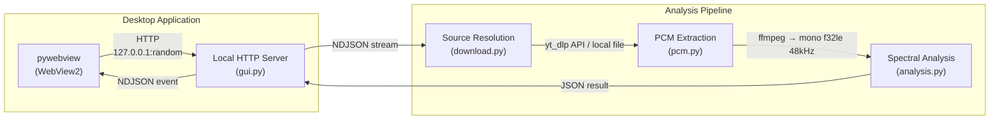

## 2. Module Structure

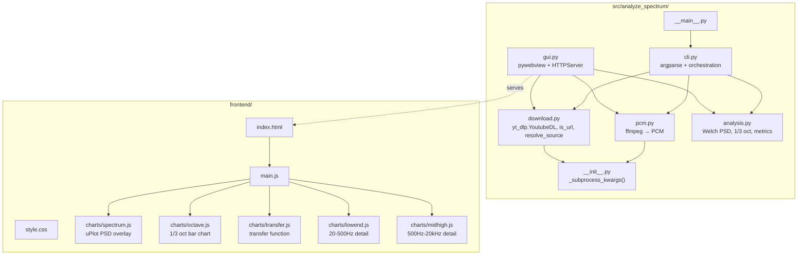

## 3. Analysis Pipeline

### 3.1 Data Flow

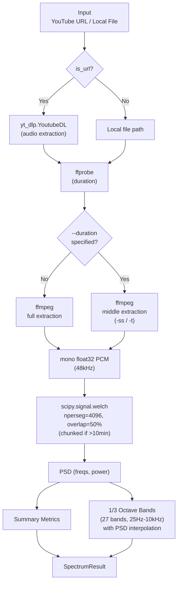

### 3.2 Summary Metrics

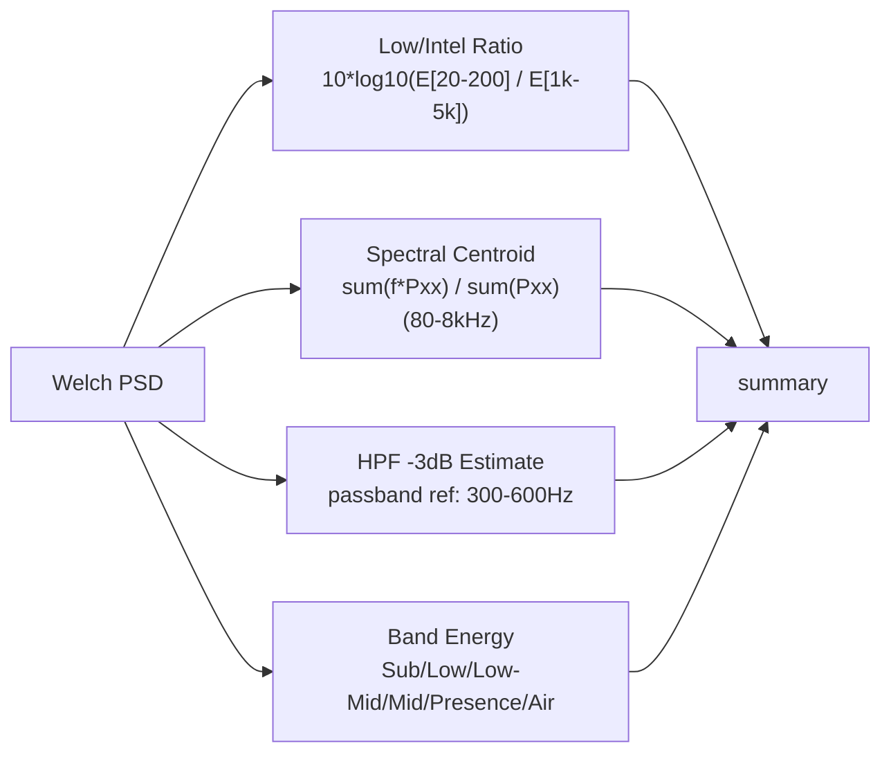

### 3.3 Comparison Mode

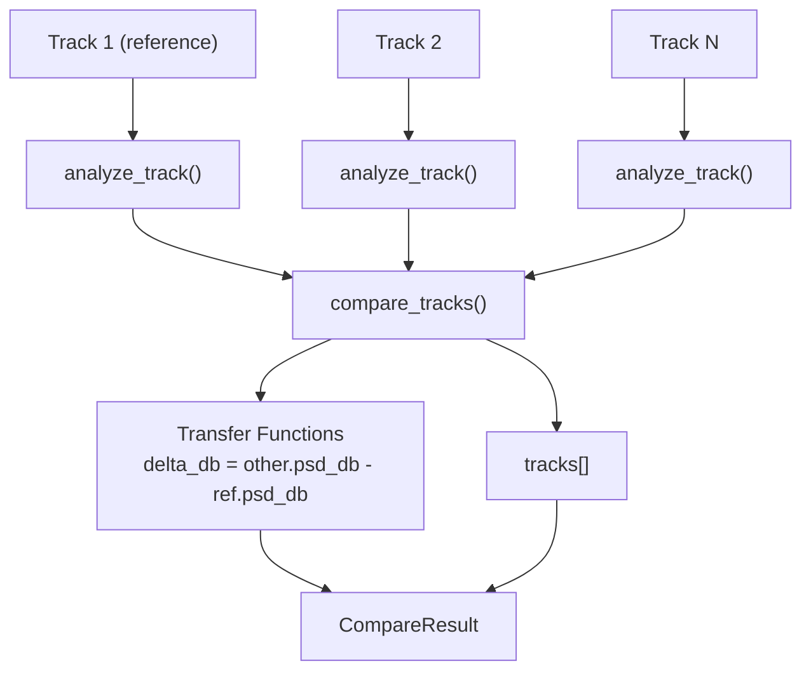

## 4. GUI Architecture

### 4.1 Communication Model

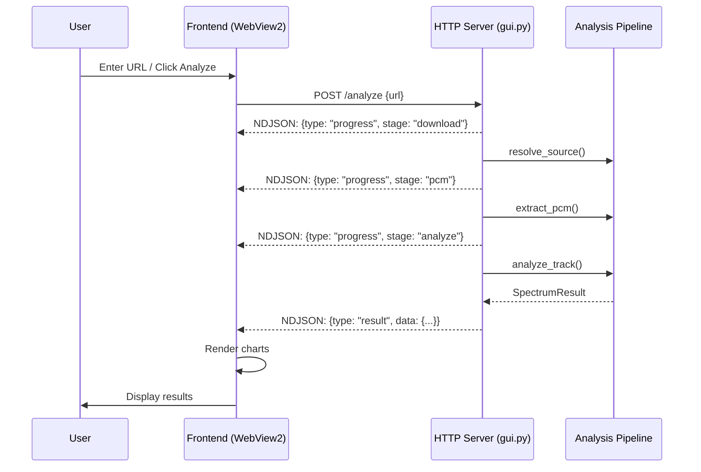

### 4.2 Compare Flow

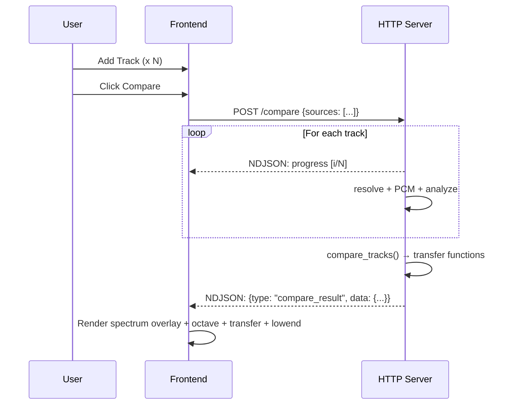

### 4.3 Result Cache

セッション内キャッシュにより同一ソースの再解析を回避する。
キャッシュは `tempfile.mkdtemp()` に作成し、プロセス終了時に削除 (session-only)。

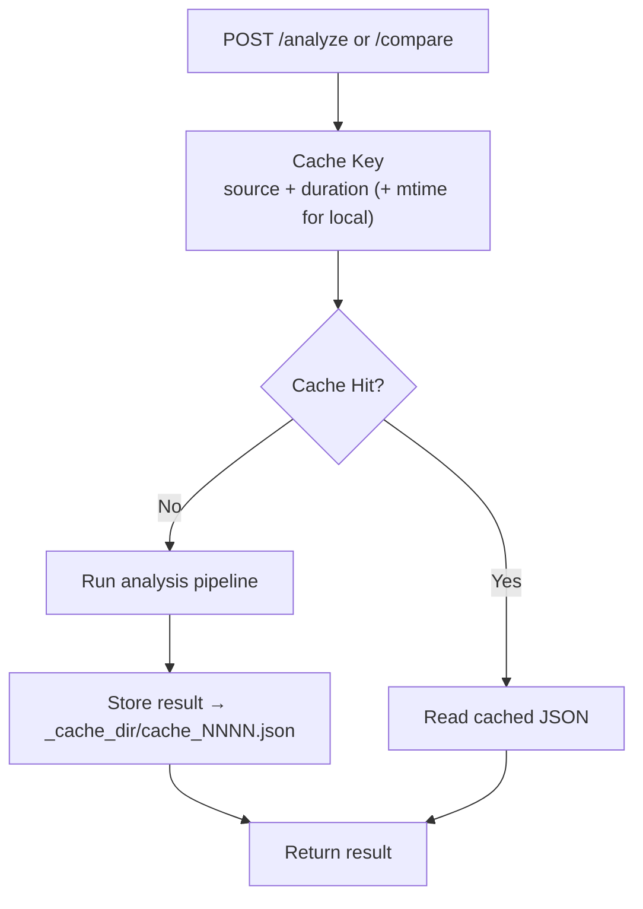

比較モードでは各トラックを個別にキャッシュ参照する:

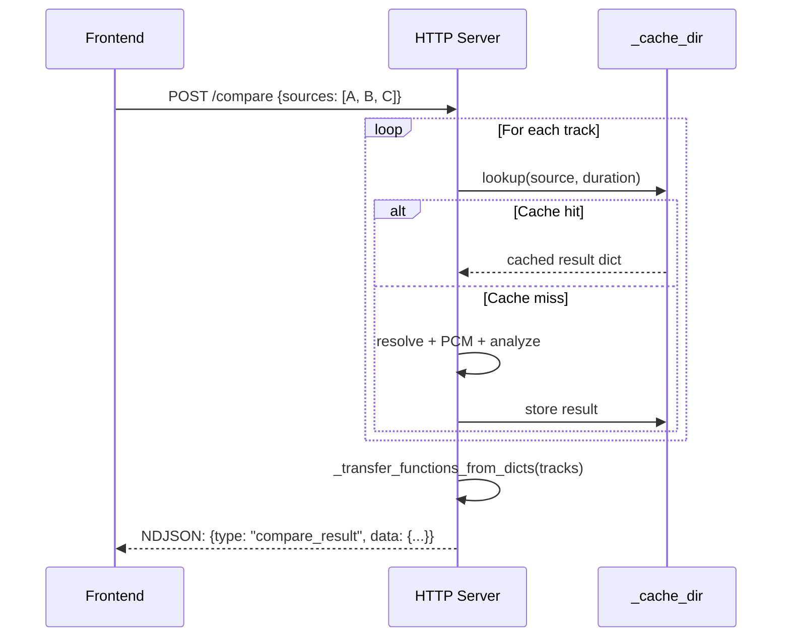

Save 最適化: `/save` に `source` + `duration` パラメータが含まれる場合、
キャッシュファイルを直接コピーし再シリアライズを回避する。

### 4.4 File Input Methods

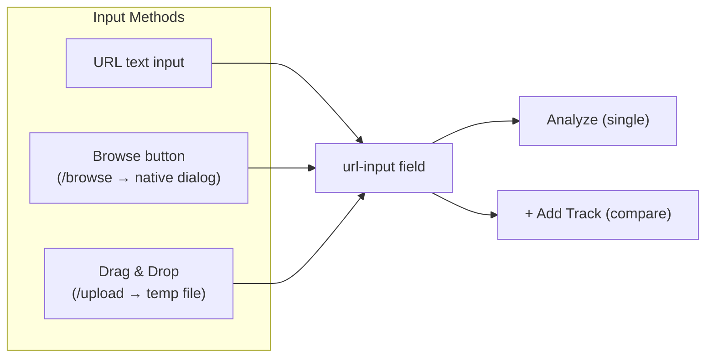

- **Browse**: `/browse` POST → pywebview `OPEN_DIALOG` → ファイルパスを返却
- **Drag & Drop**: `/upload` POST (octet-stream, X-Filename header) → 一時ディレクトリに保存 → パスを返却

### 4.5 Frontend State Machine

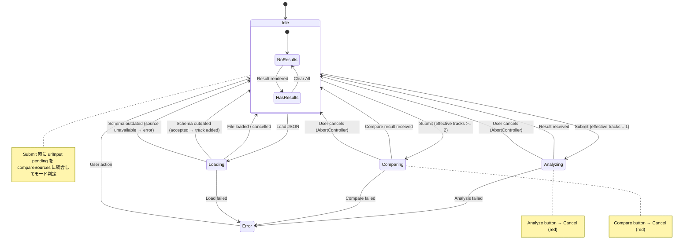

### 4.6 Cancel (Abort) Mechanism

処理中にユーザーが Cancel ボタンをクリックすると:

1. **Frontend**: `AbortController.abort()` → fetch の `signal` 経由でストリーム読み取り中断
2. **Backend**: 次の `_send_event()` 呼び出し時に `BrokenPipeError` を検知 → `_ClientDisconnected` 例外で処理ループを終了
3. **UI**: ステータスに "Cancelled." を表示、ボタンを Analyze / Compare に復帰

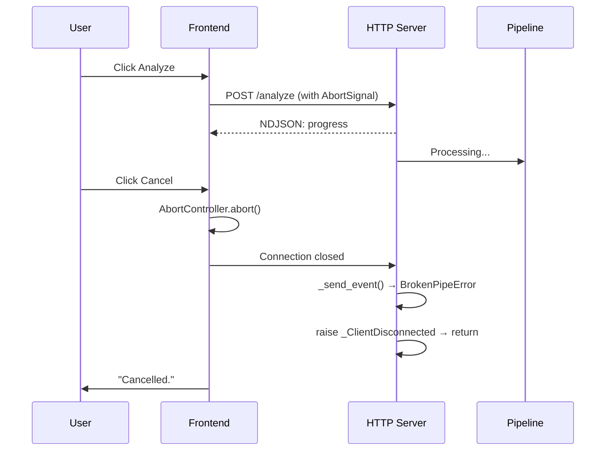

### 4.7 Theme System

3 段階テーマ切替 (Light → Dark → Auto → Light):

- **Light**: 常にライトテーマ
- **Dark**: 常にダークテーマ
- **Auto**: OS の `prefers-color-scheme` に追従 (デフォルト)

CSS カスタムプロパティ (`--bg`, `--text`, `--accent` 等) で全色を管理。
Canvas チャートは `getThemeColors()` で描画時にテーマカラーを取得。
テーマ切替時はチャートを再描画。設定は `localStorage` に保存。

## 5. Chart System

### 5.1 Chart Types

| Chart | Library | X-axis | Y-axis | Mode |
|-------|---------|--------|--------|------|
| PSD Spectrum | uPlot | log(freq) Hz | Power dB | Single / Multi-track overlay |
| 1/3 Octave | Canvas | Band center Hz | Energy dB | Single / Grouped bars |
| Transfer Function | Canvas | log(freq) Hz | Delta dB | Multi-track only |
| Low-End Detail | Canvas | Linear freq 20-500Hz | Power dB | Single / Multi-track overlay |
| Mid-High Detail | Canvas | log(freq) 500Hz-20kHz | Power dB | Single / Multi-track overlay |

### 5.2 Chart Data Flow

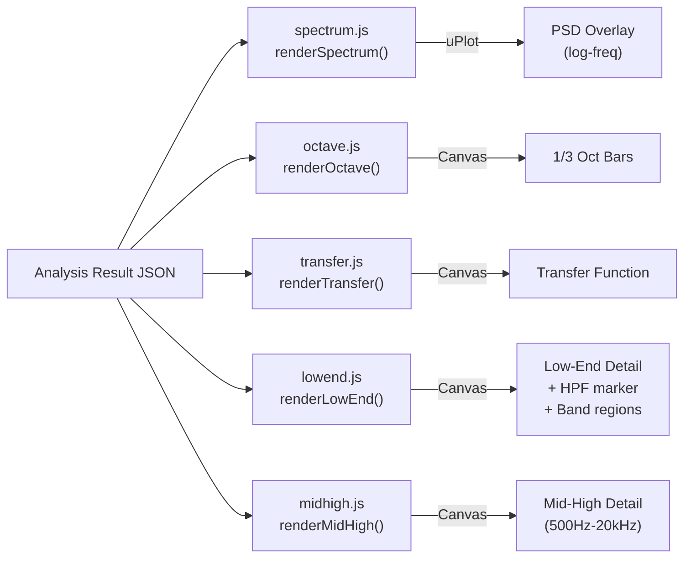

## 6. Build & Distribution

### 6.1 Build Pipeline

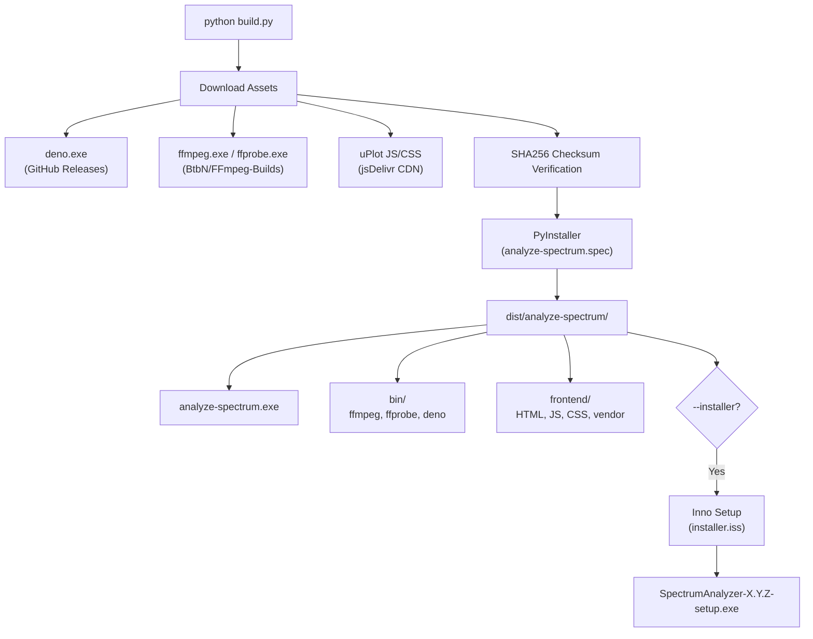

### 6.2 Bundle Structure

```
dist/analyze-spectrum/
├── analyze-spectrum.exe          # PyInstaller frozen app
├── bin/
│   ├── ffmpeg.exe
│   ├── ffprobe.exe
│   └── deno.exe
├── frontend/
│   ├── index.html
│   ├── main.js
│   ├── style.css
│   ├── charts/
│   │   ├── spectrum.js
│   │   ├── octave.js
│   │   ├── transfer.js
│   │   ├── lowend.js
│   │   └── midhigh.js
│   └── vendor/
│       ├── uPlot.iife.min.js
│       └── uPlot.min.css
├── THIRD_PARTY_LICENSES.txt
└── (Python runtime + dependencies)
```

## 7. Security Model

### 7.1 ネットワーク

- HTTP サーバーは `127.0.0.1` にバインド (外部アクセス不可)
- ポートはランダム割り当て (OS 指定)
- pywebview WebView2 の `AllowExternalDrop = False` で外部ドロップ無効化

### 7.2 入力検証

- subprocess は list 形式で実行 (shell injection 防止)
- yt-dlp は Python API (`yt_dlp.YoutubeDL`) 経由のため subprocess stdout のデコード不要。タイトルは `extract_info()` の戻り値 dict から取得 (DOM は `textContent` 経由で表示)
- POST body は 10MB 上限 (JSON)、50MB (base64 画像)、500MB (ファイルアップロード)
- アップロードファイル名は `sanitize_filename()` で無害化 (`\/:*?"<>|` → `_`、先頭末尾の `.` 除去)
- アップロード拡張子はホワイトリスト (`.wav`, `.mp3`, `.m4a` 等 13 種)
- duration パラメータは正の数値のみ許可
- `/compare` の `sources` 配列は長さのみ検証 (要素の型チェックなし。非文字列は `resolve_source()` で実行時エラー)

### 7.3 XSS 防止

- フロントエンドの DOM 操作は `textContent` ベース (ユーザー入力の HTML 解釈なし)
- `showError()` は `innerHTML = ""` でクリア後、`textContent` で再設定
- `confirm()` に表示するメッセージはユーザー選択 JSON 由来のプレーンテキスト (ネイティブ OS ダイアログ、HTML 解釈なし)

### 7.4 ファイルシステム

- アップロード一時ファイルは `tempfile.mkdtemp` + `atexit` で自動削除
- キャッシュファイルは `tempfile.mkdtemp` + `atexit` で自動削除
- `/save` のキャッシュコピーは `shutil.copy2` (ネイティブダイアログで選択されたパスのみ)

### 7.5 ビルド・配布

- ビルド時アセット (ffmpeg, ffprobe, deno, uPlot) は SHA256 チェックサム検証 (yt-dlp は Python 依存のため対象外)
- Frozen build は `_MEIPASS/bin` に PATH を限定

### 7.6 既知の制限

- キャッシュ操作 (`_result_cache`, `_cache_seq`) はスレッドロック未保護 (CPython GIL に依存、SV-06)
- `/upload` のファイル名衝突回避は TOCTOU パターン (単一ユーザーアプリとして許容、SV-09)

## 8. Reference Standards

| Standard | Usage |
|----------|-------|
| ANSI S3.5-1997 | SII band importance function (Low/Intel ratio) |
| IEC 60268-16:2020 | STI reference (intelligibility bands) |
| Upward spread of masking | Low-end masking analysis rationale |

## 9. Design Notes

### 9.1 Low-Frequency 1/3 Octave Band Interpolation

Welch PSD (nperseg=4096, 48kHz) の周波数分解能は 11.72 Hz。
低周波の 1/3 オクターブバンドはバンド幅がこれより狭い:

| Band Center | Band Width | FFT bins |
|-------------|-----------|----------|
| 25 Hz | 5.8 Hz | 0 |
| 31.5 Hz | 7.3 Hz | 0-1 |
| 40 Hz | 9.3 Hz | 0-1 |
| 50 Hz | 11.6 Hz | 1 |

バンド内に FFT ビンが存在しない場合、`np.interp` でバンド中心周波数の
PSD を補間し、帯域幅を掛けてエネルギーを推定する。

### 9.2 Chunked Welch PSD for Long Signals

scipy.signal.welch は内部でセグメント数 × 周波数ビンの中間配列を確保する。
長尺ファイル (例: 4 時間 → 350,058 セグメント × 2,049 ビン ≈ 5.3 GiB) では
メモリ不足となる。

10 分 (28,800,000 サンプル) 単位でチャンクに分割し、各チャンクの PSD を
平均して最終結果とする。周波数分解能は変わらない。

## 10. Test Architecture

### 10.1 テスト構成 (104 tests)

| ファイル | 種別 | 主な対象 |
|----------|------|----------|
| `tests/conftest.py` | fixture | 共有 WAV バイト生成 (`_make_wav_bytes`, `wav_file`, `wav_file_b`) |
| `tests/test_analysis.py` | unit | 解析コア (Welch PSD, 1/3 oct, metrics) |
| `tests/test_pcm.py` | unit | ffmpeg → PCM 変換 |
| `tests/test_cli.py` | unit | argparse + CLI 統合 |
| `tests/test_download.py` | unit | yt_dlp.YoutubeDL API, ffprobe duration |
| `tests/test_gui.py` | unit | gui.py (モック使用) |
| `tests/test_integration.py` | integration | HTTPServer + 解析パイプライン (28 tests) |
| `tests/test_frontend.py` | e2e | Playwright headless Chromium runner |
| `tests/frontend/test_ui.js` | browser | フロントエンド UI 状態テスト (75 assertions) |

### 10.2 Integration テスト

`test_integration.py` は pywebview を使わず `HTTPServer` を直接起動し、
実解析パイプラインを通して各エンドポイントを検証する。

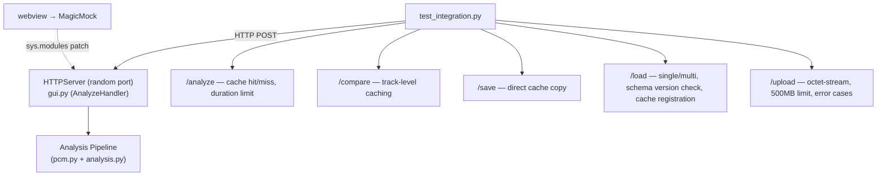

### 10.3 Frontend UI テスト

`test_frontend.py` は Playwright で headless Chromium を起動し、
`tests/frontend/test_ui.html` をローカル HTTP サーバー経由で開いて
`window._testResult` から合否を読み取る。

`test_ui.js` は fetch をモックして DOM 状態を直接検証する:

- トラック追加 / 削除
- 重複トラック拒否
- 6 トラック上限
- Load JSON (単一 / 複数 / 旧スキーマ承認・拒否) + 保留ソース保持
- テーマトグル (Light → Dark → Auto)
- Clear All
- setBusy ボタン状態
- Submit ラベル (urlInput 入力による動的更新含む)
- Submit 時の pending urlInput 統合 (NDJSON ストリームモック)
- Submit 時の 6 トラック上限拒否
- 1 トラック + urlInput 空での単体解析
- Remove Track 時の urlInput 値保持

`playwright>=1.40` が dev dependency として追加されている。

### 10.4 ホワイトフラッシュ防止

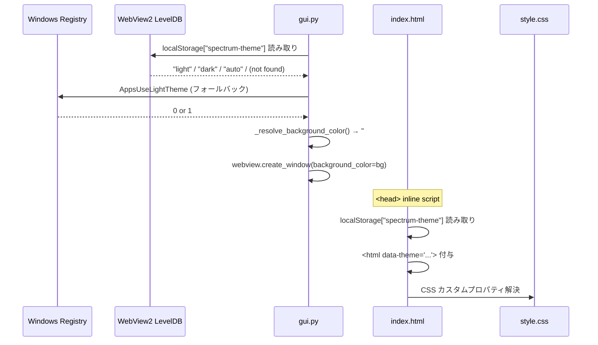

## 11. Known Limitations

- 比較は最大 6 トラック (チャートの可読性)
- リアルタイム入力 (マイク) は対象外
- 48kHz mono float32 = 192 KB/s → 10 分で約 115 MB (メモリ制約)
- 長尺は `--duration` で中盤抽出で対処
