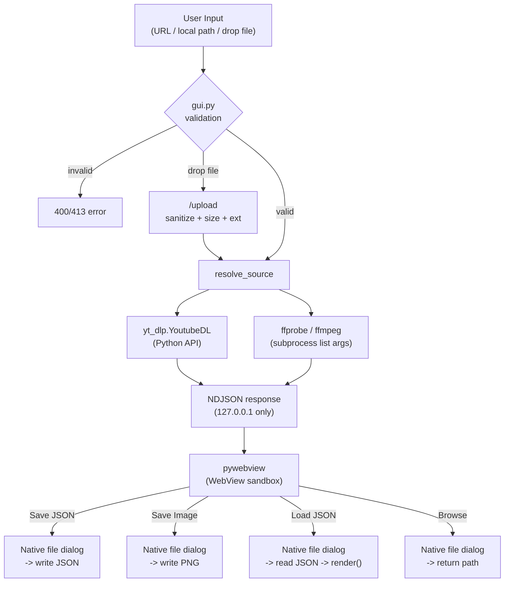

# Security Audit Report

**Date**: 2026-04-18
**Scope**: CLI (`src/analyze_spectrum/`), GUI (`src/analyze_spectrum/gui.py`), Frontend SPA (`frontend/`), Build/Distribution (`build.py`, `analyze-spectrum.spec`, `installer.iss`)

## Summary

| Category | Findings | Open | Resolved | Accepted |
|----------|----------|------|----------|----------|
| Local HTTP Server | 2 | 0 | 1 | 1 |
| Input Validation | 4 | 0 | 4 | 0 |
| Command Injection | 1 | 0 | 0 | 1 |
| File I/O (Save/Load/Browse) | 5 | 0 | 2 | 3 |
| File Upload (Drag & Drop) | 2 | 0 | 2 | 0 |
| Data Exposure | 1 | 0 | 0 | 1 |
| XSS | 1 | 0 | 0 | 1 |
| Subprocess Management | 2 | 0 | 1 | 1 |
| Bundled Binaries | 2 | 0 | 2 | 0 |
| Resource Management | 2 | 0 | 0 | 2 |
| **Total** | **22** | **0** | **12** | **10** |

**Open: 0** / Resolved: 12 / Accepted (risk acknowledged): 10

---

## Resolved Findings

### SEC-01: バンドルバイナリの整合性検証 -- RESOLVED

- **Risk**: LOW -> RESOLVED
- **Location**: [build.py](../build.py), [build_assets/checksums.json](../build_assets/checksums.json)
- **Resolution**: `build_assets/checksums.json` にダウンロード済みアセット (ffmpeg, ffprobe, deno, uPlot) の SHA256 ハッシュをプラットフォーム別 (`windows` / `macos`) に記録し、ビルド時に `_PLATFORM_KEY` で現在のプラットフォームのハッシュを照合して不一致で停止する仕組みを実装。
  - `python build.py --update-checksums`: ダウンロード + ハッシュ算出 + checksums.json 更新
  - `python build.py`: ダウンロード + checksums.json と照合 (不一致で停止)
  - checksums.json は git 管理対象
  - JSON 構造は analyze-loudness と統一 (`{ "windows": {...}, "macos": {...} }`)

### SEC-02: ローカル HTTP サーバーがループバック以外からアクセス可能 -- RESOLVED

- **Risk**: LOW -> RESOLVED
- **Location**: [gui.py](../src/analyze_spectrum/gui.py)
- **Resolution**: `HTTPServer(("127.0.0.1", 0), ...)` で 127.0.0.1 にバインド。外部ネットワークからのアクセス不可。ポートは OS が自動割当 (port 0) するため、他アプリとの競合も予測困難性も同時に確保。

### SEC-03: URL / ファイルパス入力のバリデーション (GUI) -- RESOLVED

- **Risk**: LOW -> RESOLVED
- **Location**: [gui.py](../src/analyze_spectrum/gui.py) `_handle_analyze` / `_handle_compare`
- **Resolution**: `url` フィールドの存在と `str` 型をチェック。空文字列は 400 エラーで拒否。比較モードでは `sources` 配列の最小 2 件 / 最大 6 件を強制。URL でない場合は `resolve_source` 内で `Path.exists()` チェックし、存在しないファイルは `FileNotFoundError` で拒否。

### SEC-04: duration パラメータのバリデーション -- RESOLVED

- **Risk**: LOW -> RESOLVED
- **Location**: [gui.py](../src/analyze_spectrum/gui.py) `_parse_duration`
- **Resolution**: `float()` 変換 + `math.isfinite()` (NaN / ±Inf 拒否) + 正数チェック。不正値は 400 エラーで拒否。`compute_middle` も `total_sec > 0` / `duration_min > 0` を検証。

### SEC-05: Windows subprocess コンソール非表示 -- RESOLVED

- **Risk**: LOW -> RESOLVED
- **Location**: [__init__.py](../src/analyze_spectrum/__init__.py) -> `analyze_common.platform.subprocess_kwargs()`
- **Resolution**: frozen mode 時に `STARTF_USESHOWWINDOW` を設定。ffmpeg / ffprobe / deno のコンソールウインドウを抑制し、UX を改善。yt-dlp は Python API として動作するため subprocess 起動しない。

### SEC-06: バンドルバイナリのバージョン管理 -- RESOLVED

- **Risk**: MEDIUM -> RESOLVED
- **Location**: [build.py](../build.py)
- **Resolution**: `build.py` が GitHub API / 公式配布元から最新安定版を取得。`--skip-download` フラグで既存バイナリの再利用も可能。全て HTTPS 経由でダウンロード。

### SEC-07: 不正 JSON リクエストボディの処理 -- RESOLVED

- **Risk**: LOW -> RESOLVED
- **Location**: [gui.py](../src/analyze_spectrum/gui.py) `_read_json_body`
- **Resolution**: `_read_json_body()` で `JSONDecodeError` / `ValueError` を catch し `None` を返却、呼び出し側が 400 エラーで拒否。ペイロードサイズ上限 (`_MAX_BODY = 10 MB`, 画像系は `_MAX_IMAGE_BODY = 50 MB`) で過大ペイロードも拒否。

### SEC-08: アップロードファイル名のサニタイズ -- RESOLVED

- **Risk**: MEDIUM -> RESOLVED
- **Location**: [download.py](../src/analyze_spectrum/download.py) `sanitize_filename`, [gui.py](../src/analyze_spectrum/gui.py) `_handle_upload`
- **Resolution**: `sanitize_filename` が `/`, `\`, `:`, `*`, `?`, `"`, `<`, `>`, `|` を `_` に置換。先頭末尾の `.` と空白を strip。これにより `../../../etc/passwd.wav` 等の path traversal 攻撃は `_.._.._etc_passwd.wav` のように無害化される。さらに拡張子を allowlist (`.wav, .mp3, .m4a, .flac, .ogg, .opus, .wma, .aac, .aiff, .aif, .webm, .mkv, .mp4`) に限定。
  - 同名ファイル衝突時は timestamp suffix で回避
  - 書き込み先は `_upload_dir` (`tempfile.mkdtemp`) に固定、`atexit` で削除

### SEC-09: アップロードサイズ上限 -- RESOLVED

- **Risk**: MEDIUM -> RESOLVED
- **Location**: [gui.py](../src/analyze_spectrum/gui.py) `_handle_upload`
- **Resolution**: `_MAX_UPLOAD = 500 MB` で Content-Length をチェックし、超過時は 413 で拒否。受信途中で切断された場合 (`remaining > 0`) は書き込み途中のファイルを削除し 400 エラー。

### SEC-10: アップロード完了前のファイル断片残留 -- RESOLVED

- **Risk**: LOW -> RESOLVED
- **Location**: [gui.py](../src/analyze_spectrum/gui.py) `_handle_upload`
- **Resolution**: 受信チャンクループが `remaining > 0` のまま抜けた場合 (Content-Length 分を受信しきれなかった場合) は `os.unlink` で途中ファイルを削除し 400 エラー。クライアント切断時でもディスクに不完全データが残らない。

### SEC-22: pywebview ダイアログ例外のサイレント握りつぶし -- RESOLVED

- **Risk**: LOW -> RESOLVED
- **Location**: [gui.py](../src/analyze_spectrum/gui.py) `_handle_save`, `_handle_save_image`, `_handle_load`, `_handle_browse`; [main.js](../frontend/main.js) clipboard copy
- **Resolution**: `create_file_dialog()` の例外を `except Exception: result = None` で握りつぶしていたため、ダイアログ障害時にユーザーへ「キャンセル」と誤通知していた。`traceback.print_exc()` + `_json_error(500, ...)` でフロントエンドにエラーを返却するよう修正。POST ハンドラの二重 catch 内側 (`pass`) も `traceback.print_exc()` に変更し、エラーレスポンス送信失敗を記録。フロントエンドのクリップボード copy 失敗は `btn.copy_failed` テキストで通知。analyze-loudness にも同一修正を適用。

### SEC-11: HTTP レスポンスのメッセージ フレーミング -- RESOLVED

- **Risk**: LOW -> RESOLVED
- **Location**: [gui.py](../src/analyze_spectrum/gui.py) `_json_response`, `_send_event`
- **Resolution**: 通常 JSON レスポンスに `Content-Length` ヘッダーを明示的に付与。EOF-framing ベースの切断で発生していた `ConnectionResetError` / テスト flakiness を解消。NDJSON ストリームは従来通りチャンク送信。さらにレスポンスボディの書き込みを `self.wfile.write()` から `self.request.sendall()` に変更。`wfile` (`SocketIO`, `wbufsize=0`) は内部で `socket.send()` に委譲し、ペイロードが `SO_SNDBUF` (~128 KB on macOS) を超えると partial write するため、大きな JSON レスポンスが黙って切り詰められる問題があった。`sendall()` は全バイト送信まで内部ループするため確実に配信される。

---

## Accepted Findings (risk acknowledged)

### SEC-12: ローカル HTTP サーバーの同一ホスト攻撃面 -- ACCEPTED

- **Risk**: VERY LOW
- **Location**: [gui.py](../src/analyze_spectrum/gui.py)
- **Analysis**: 127.0.0.1 バインドのため、同一マシン上の他プロセスからは `/analyze`, `/compare`, `/upload` 等のエンドポイントにアクセス可能。ただし:
  - ポートはランダム (port 0) のため予測困難
  - ブラウザの same-origin policy により、外部サイトからの CSRF は Content-Type: application/json の POST が preflight で阻止される
  - `/upload` は binary body + custom `X-Filename` header 前提のため、HTML フォームからの simple request ではトリガーできない (preflight 発生)
  - ローカルアプリの標準的な設計パターン
  - 最悪でも音声の分析が実行されるのみ（データ破壊なし）

### SEC-13: subprocess への URL / パス直接渡し -- SAFE

- **Risk**: NOT VULNERABLE
- **Location**: [pcm.py](../src/analyze_spectrum/pcm.py), [download.py](../src/analyze_spectrum/download.py)
- **Analysis**:
  - `subprocess.run(cmd, ...)` はすべてリスト引数 (`shell=False`) -> shell injection 不可
  - yt-dlp は Python API (`yt_dlp.YoutubeDL`) 経由で使用、subprocess を介さない
  - ユーザーが自分で入力した URL / ファイルパスをローカルで実行するため、攻撃ベクトルが成立しない

### SEC-14: フロントエンド XSS -- SAFE

- **Risk**: NOT VULNERABLE
- **Location**: [main.js](../frontend/main.js)
- **Analysis**:
  - トラックラベル / タイトル -> `textContent` (HTML パース不可)
  - `innerHTML` は数値フォーマット (`.toFixed()`) と静的テンプレート文字列のみ
  - ユーザー由来文字列は `innerHTML` パスに含まれない
  - `/load` エンドポイント経由で読み込んだ JSON も同じ表示パスを通るため XSS 耐性あり

### SEC-15: エラーメッセージによる内部情報露出 -- ACCEPTED

- **Risk**: VERY LOW
- **Location**: [gui.py](../src/analyze_spectrum/gui.py)
- **Analysis**: エラーメッセージは NDJSON / JSON で 127.0.0.1 にのみ送信される。ローカルアプリのためデバッグ情報の露出リスクは実質ゼロ。ffprobe/ffmpeg の stderr 末尾 500 文字を含めるが、攻撃者は同一ホスト上のユーザーに限定される。

### SEC-16: 一時ファイルのクリーンアップ -- SAFE

- **Risk**: NOT VULNERABLE
- **Location**: [gui.py](../src/analyze_spectrum/gui.py), [cli.py](../src/analyze_spectrum/cli.py), [pcm.py](../src/analyze_spectrum/pcm.py)
- **Analysis**:
  - 解析中の作業ディレクトリ: `tempfile.TemporaryDirectory` + `with` ブロック -> 例外発生時も自動削除
  - PCM 抽出中間ファイル: `tempfile.NamedTemporaryFile` + `try/finally` + `unlink(missing_ok=True)`
  - `_upload_dir`, `_cache_dir`: `tempfile.mkdtemp` + `atexit.register(shutil.rmtree, ...)` で通常終了時にクリーンアップ

### SEC-17: `/save` エンドポイントによるファイル書き込み -- ACCEPTED

- **Risk**: VERY LOW
- **Location**: [gui.py](../src/analyze_spectrum/gui.py) `_handle_save`
- **Analysis**: `/save` POST で JSON データをユーザー選択パスに書き込み可能。ただし:
  - 保存先パスは pywebview のネイティブファイルダイアログでユーザーが選択
  - 127.0.0.1 + ランダムポートのため外部からのアクセス不可
  - 書き込みエラーは `OSError` でキャッチし、エラーレスポンスを返却
  - 書き込む内容は分析結果 JSON のみ (実行可能コードではない)
  - キャッシュ済みデータは `shutil.copy2` でコピー、未キャッシュ時はリクエストボディから書き出し

### SEC-18: `/save-image` エンドポイントによる PNG 書き込み -- ACCEPTED

- **Risk**: VERY LOW
- **Location**: [gui.py](../src/analyze_spectrum/gui.py) `_handle_save_image`
- **Analysis**: `/save-image` POST で base64 エンコード PNG をユーザー選択パスに書き込み。
  - `data:image/png;base64,` prefix を検証し、不正な形式は 400 で拒否
  - `base64.b64decode` が不正な base64 を `ValueError` として拒否（catch 済み）
  - 保存先は SEC-17 と同様にネイティブダイアログでユーザーが選択
  - 127.0.0.1 + ランダムポートのため外部からの呼び出し不可

### SEC-19: `/load` および `/browse` エンドポイントによるファイル読み込み -- ACCEPTED

- **Risk**: VERY LOW
- **Location**: [gui.py](../src/analyze_spectrum/gui.py) `_handle_load`, `_handle_browse`
- **Analysis**:
  - `/load`: ユーザー選択パスから JSON を読み込み、`spectrum` フィールドの存在を検証。`tracks` キーを含む古い compare 形式は明示的に 400 で拒否 (loading individual tracks への誘導)。`schema_version` が古い場合は再分析を促す
  - `/browse`: 音声ファイル選択ダイアログを開き、選択パスを返却するのみ (読み込みや実行は行わない)
  - どちらも `OSError` / `JSONDecodeError` を catch しエラーレスポンスを返却
  - 127.0.0.1 + ランダムポートのため外部からの呼び出し不可
  - 読み込んだデータはフロントエンドの `render()` に渡されるが、ユーザー由来文字列は `textContent` 経由で安全に表示（SEC-14 参照）

### SEC-20: クライアント切断時の subprocess orphaning -- ACCEPTED

- **Risk**: LOW
- **Location**: [gui.py](../src/analyze_spectrum/gui.py), [pcm.py](../src/analyze_spectrum/pcm.py), [download.py](../src/analyze_spectrum/download.py)
- **Analysis**: フロントエンドの Cancel (AbortController) でストリーム読み取りを中断すると、サーバー側の `_send_event()` が `_ClientDisconnected` を発生させて分析を中断する。ただし `yt_dlp.YoutubeDL.extract_info()` や `subprocess.run()` (ffmpeg/ffprobe) がブロッキング中の場合、該当処理は完了まで実行が継続する。
  - `_ClientDisconnected` は次の `_send_event()` 呼び出し時にのみ検出される
  - yt_dlp ダウンロード中や ffmpeg PCM 抽出中 (数秒〜十数秒) にキャンセルしても、該当処理は完了まで実行
  - 完了後に `_send_event()` が `_ClientDisconnected` を送出し、以降の処理を中断
  - `TemporaryDirectory` / `atexit` cleanup により一時ファイルのリークは発生しない
- **Accepted**: 最大でも十数秒の不要な subprocess 実行のみ。単一ユーザーのローカルアプリでは DoS やリソース枯渇のリスクなし

### SEC-21: キャッシュディレクトリの肥大化 -- ACCEPTED

- **Risk**: VERY LOW
- **Location**: [gui.py](../src/analyze_spectrum/gui.py) `_cache_put`
- **Analysis**: `_cache_dir` に解析結果 JSON をセッション全体で蓄積するため、同一セッション中に多数の URL / ファイルを解析するとディスク使用量が増加する。ただし:
  - 解析結果 JSON 1 件あたり数十〜数百 KB (スペクトルグラフ配列) 程度で、数百件でも 100 MB 未満
  - `atexit.register(shutil.rmtree, _cache_dir, True)` でアプリ終了時に削除
  - 異常終了 (SIGKILL 等) では残存するが、`spectrum_cache_` prefix で `tempfile` 領域に作成されるため OS 側の clean-up 対象
  - 単一ユーザーのローカルアプリでは実害なし

---

## Threat Model

### Attack Surface

| Entry Point | Protocol | Auth | Validation |
|------------|----------|------|------------|
| CLI args | Local | N/A | argparse + `compute_middle` validation |
| GUI HTTP (`/analyze`) | 127.0.0.1 only | N/A (localhost) | URL/source + duration + JSON body validation |
| GUI HTTP (`/compare`) | 127.0.0.1 only | N/A (localhost) | sources array (2-6) + duration validation |
| GUI HTTP (`/upload`) | 127.0.0.1 only | N/A (localhost) | size limit 500MB + extension allowlist + `sanitize_filename` |
| GUI HTTP (`/save`, `/save-image`) | 127.0.0.1 only | N/A (localhost) | Native file dialog + content validation |
| GUI HTTP (`/load`, `/browse`) | 127.0.0.1 only | N/A (localhost) | Native file dialog + schema validation |
| Frontend SPA | pywebview (WebView2/WKWebView) | N/A | Static files, no SSR |
| File dialogs | Native OS | User interaction required | pywebview SAVE_DIALOG / OPEN_DIALOG, `_dialog_lock` non-blocking try-lock (409 on concurrent) |

### Abuse Scenarios

| Scenario | Impact | Mitigation | Status |
|----------|--------|------------|--------|
| External network access | Remote attack | 127.0.0.1 bind | Not vulnerable |
| Shell injection via URL/path | RCE | `subprocess.run` list args, yt-dlp Python API | Not vulnerable |
| Path traversal via /upload filename | Arbitrary file write | `sanitize_filename` (`/`, `\` 等を `_` 化) + extension allowlist | Resolved (SEC-08) |
| Oversized upload | Disk exhaustion | 500 MB limit + incomplete-upload cleanup | Resolved (SEC-09, SEC-10) |
| Malicious bundled binary | Code execution | SHA256 checksum verification | Resolved (SEC-01) |
| Local CSRF | Unintended analysis | Random port, JSON Content-Type preflight, custom headers for /upload | Very low risk |
| Disk exhaustion (large video) | DoS | `TemporaryDirectory` auto-cleanup | Low risk |
| Arbitrary file write via /save | Data overwrite | Native dialog + 127.0.0.1 + random port | Very low risk |
| Arbitrary file read via /load | Info disclosure | Native dialog + 127.0.0.1 + random port + schema validation | Very low risk |
| XSS via loaded JSON label | Code execution | `textContent` (no HTML parse) | Not vulnerable |
| Invalid base64 in /save-image | Server crash | `ValueError` caught | Resolved |
| Non-finite duration (NaN/Inf) | Server crash / infinite loop | `math.isfinite` check | Resolved (SEC-04) |
| Cancel during subprocess | Orphaned process (~十数s) | `_ClientDisconnected` + `TemporaryDirectory` cleanup | Accepted (low) |
| Cache directory growth | Disk usage | `atexit` cleanup + tempfile location | Very low risk |

## Compliance Notes

- No user data stored (stateless analysis, temp files / upload dir / cache dir auto-deleted on exit)
- No authentication tokens or cookies
- No PII processing
- No network listeners on external interfaces
- Audio content analyzed locally, deleted after display / app exit
- ffmpeg bundled under GPL-2.0+ (source availability required for redistribution)
- yt-dlp bundled under Unlicense (Python dependency, not binary)
- deno bundled under MIT (required by yt-dlp for YouTube JS extraction)
- THIRD_PARTY_LICENSES.txt included in installer
